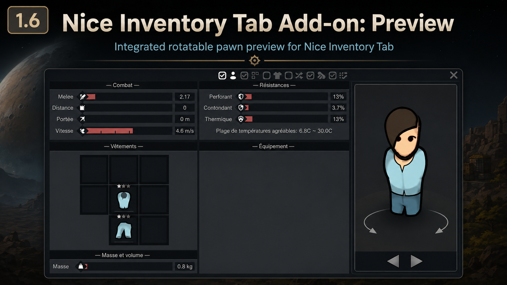
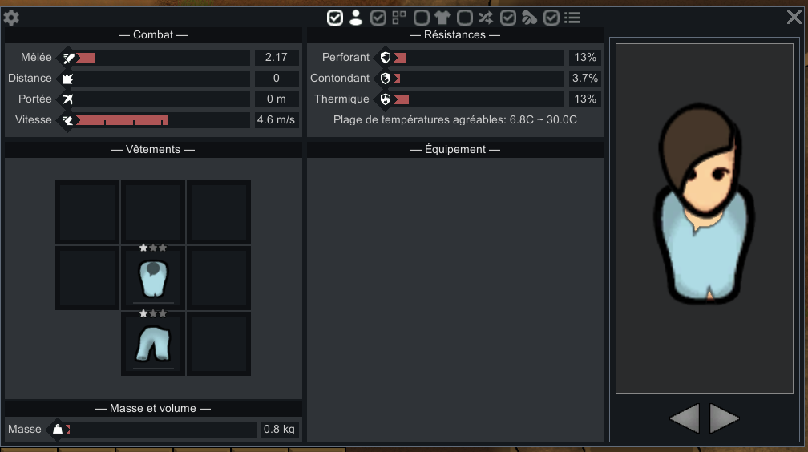

# Nice Inventory Tab Add-on: Preview

RimWorld 1.6 add-on for **Nice Inventory Tab** that adds a rotatable preview of the selected pawn without modifying the original mod.





## Stable release

Current stable version:

```text
1.0.0 - Initial Workshop release
```

Steam Workshop:

https://steamcommunity.com/sharedfiles/filedetails/?id=3777164660

## Features

- Preview integrated directly beside Nice Inventory Tab.
- Follows the selected pawn or corpse.
- Rotates through all four orientations with left and right controls.
- Can be shown or hidden from the Nice Inventory Tab toolbar.
- Expands the host tab only while visible and closes with it.
- Uses runtime compatibility checks and never modifies Nice Inventory Tab's assembly.

## Requirements

- RimWorld 1.6
- Harmony
- Nice Inventory Tab
- .NET SDK capable of building `net472` for development builds

## Build

From the repository root:

```powershell
.\build.cmd
```

The default paths match the maintainer's current RimWorld installation. A different RimWorld Managed directory can be passed as the first argument.

```powershell
.\build.cmd "C:\Program Files (x86)\Steam\steamapps\common\RimWorld\RimWorldWin64_Data\Managed"
```

The compiled assembly is written to `1.6/Assemblies/`.

## Clean RimWorld package

Build and generate the player-facing ZIP with:

```powershell
.\package-mod.cmd
```

The archive is written to `dist/` and contains only the installable mod folder. Source code, documentation, tools, screenshots, debug symbols and repository metadata are excluded and validated before success is reported.

## Workshop staging

Build, package and install a clean local copy into RimWorld's `Mods` directory with:

```powershell
.\stage-workshop.cmd
```

The staging command preserves `About/PublishedFileId.txt`, ensuring that later uploads update Workshop item `3777164660` instead of creating a new item.

See [`docs/PACKAGING.md`](docs/PACKAGING.md), [`docs/WORKSHOP_DESCRIPTION.md`](docs/WORKSHOP_DESCRIPTION.md) and [`docs/WORKSHOP_PUBLICATION.md`](docs/WORKSHOP_PUBLICATION.md).

## Development workflow

- `main`: stable releases beginning with `1.0.0`.
- `develop`: latest validated development milestone.
- `feature/*`: one temporary feature or release-preparation milestone.
- `fix/*`: one temporary corrective milestone.
- Final milestone commits use `<version> - <description>`.
- Local revision suffixes such as `r1` are never used in commits or tags.
- Validated milestones are integrated into `develop` with `--ff-only` and receive one annotated `v<version>` tag.
- Stable releases are fast-forwarded from `develop` into `main`.

See [`docs/BRANCHING_WORKFLOW.md`](docs/BRANCHING_WORKFLOW.md) and [`docs/MILESTONE_PUBLICATION.md`](docs/MILESTONE_PUBLICATION.md).
